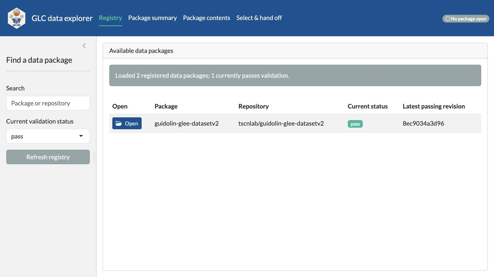
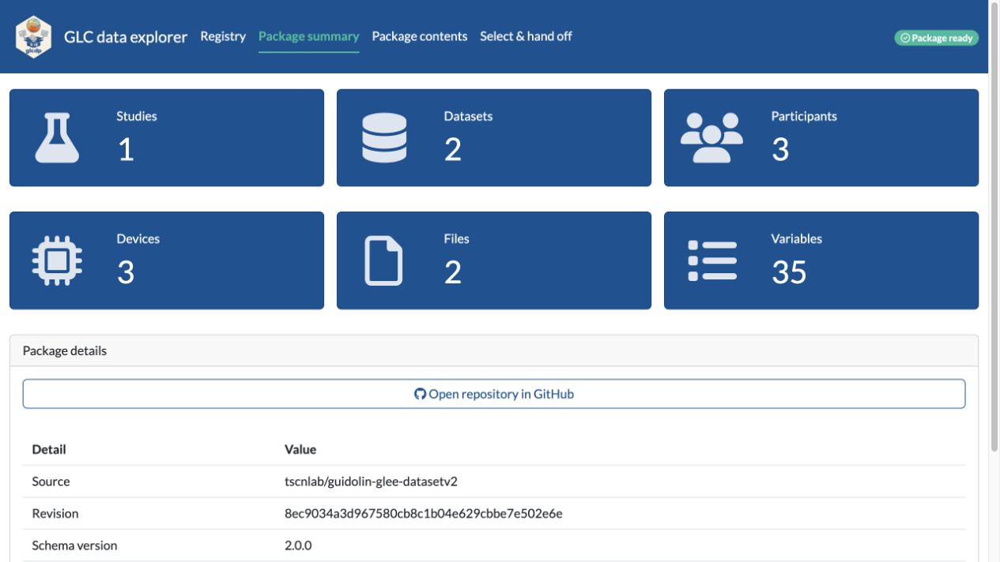
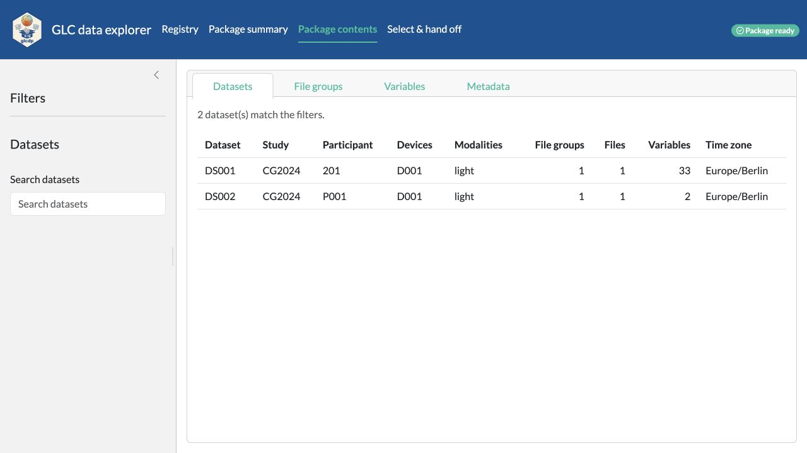
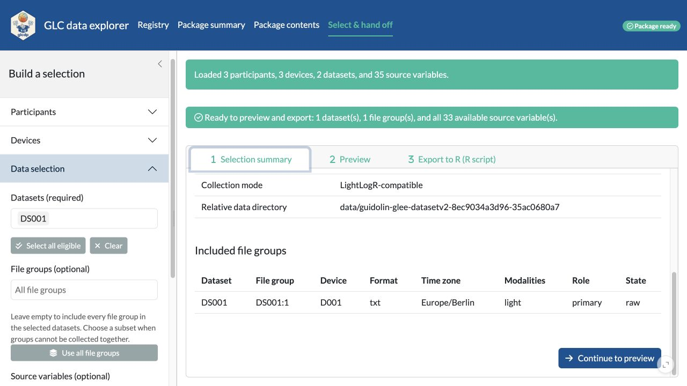
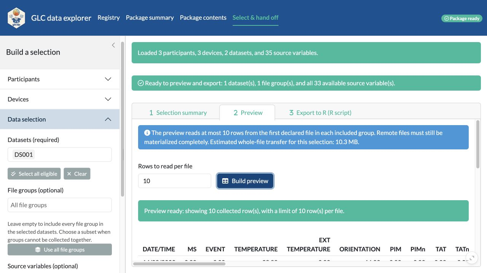
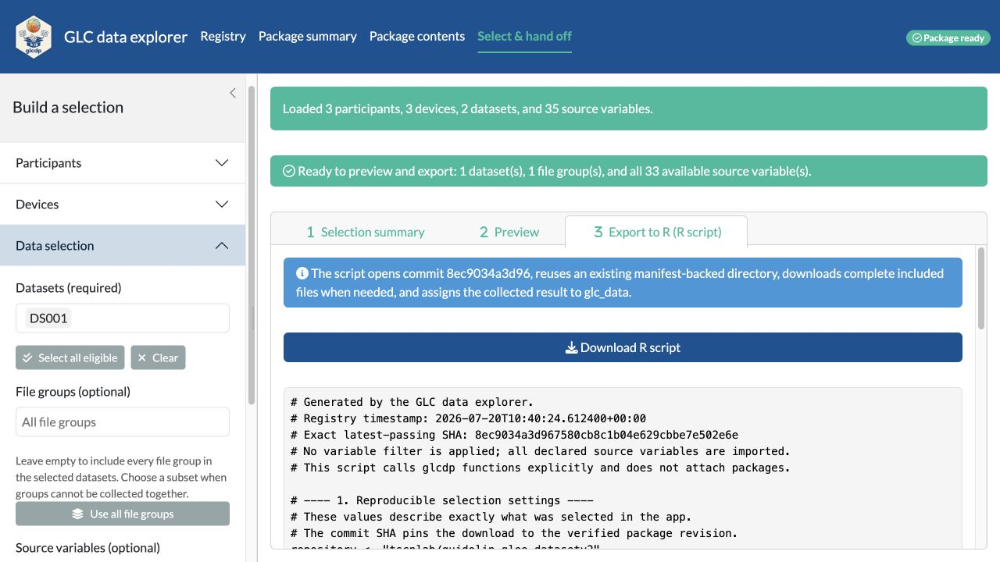
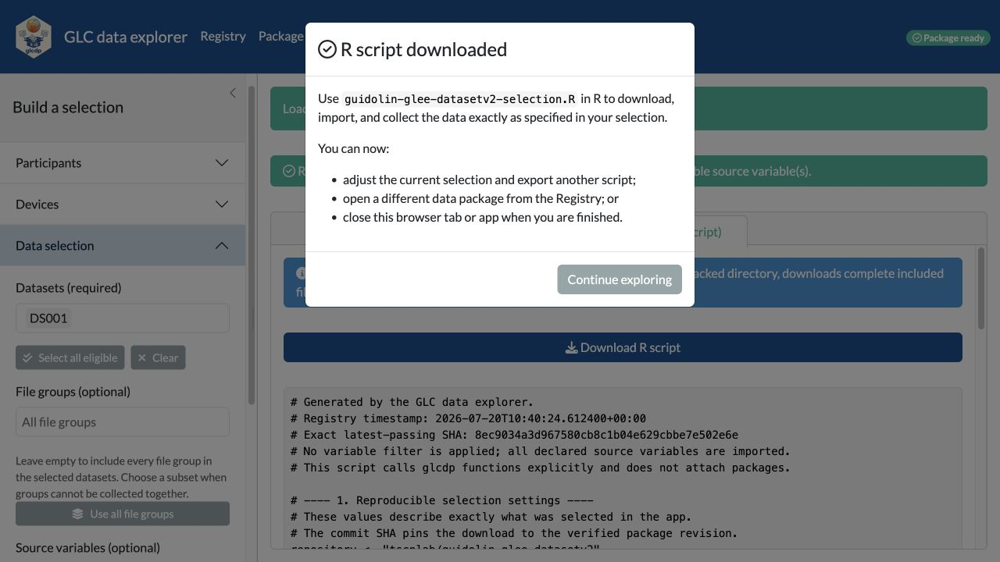

```{r setup, include = FALSE}
knitr::opts_chunk$set(
  collapse = TRUE,
  comment = "#>",
  fig.align = "center",
  out.width = "100%"
)
```

The GLC data explorer provides a guided path from a registered data package to
an annotated R import script. It is useful when you want to inspect a package
and define a reproducible selection without first learning every `glcdp`
function.

Install the optional application dependencies once, then start the app:

```{r launch, eval = FALSE}
install.packages(c("shiny", "bslib"))
glcdp::glc_explore()
```

The app opens in a browser. It runs in the current R session, and package data
are not uploaded to another service.

## 1. Open a passing package revision

The **Registry** starts with packages whose current validation status is
`pass`. Search by package or repository, or change the status filter to inspect
other registry entries. The status message reports both the number of
registered packages and how many currently pass validation.

Only rows with a latest passing revision have an **Open** button. Opening a row
uses its exact passing commit rather than a moving branch.

```{r registry-screen, echo = FALSE, fig.alt = "Registry page with validation filters and an Open button for a passing package"}

```

## 2. Understand the package at a glance

After the package opens, the app moves directly to **Package summary**. The
value boxes report the number of studies, datasets, participants, devices,
files, and variables. Each box is a shortcut to the corresponding inventory or
metadata view. The package details also pin the source repository and complete
revision SHA.

```{r summary-screen, echo = FALSE, fig.alt = "Package summary with linked inventory counts and package details"}

```

## 3. Inspect package contents

Use **Package contents** to examine four complementary views:

- **Datasets** connects studies, participants, devices, modalities, file
  groups, files, variables, and time zones.
- **File groups** shows which source files belong together.
- **Variables** shows declared source columns by one or more datasets.
- **Metadata** provides both a hierarchical view and a comparison table.

The sidebar changes with the active view, so only relevant filters are shown.
For nested metadata, find a field in **Hierarchy**, search for its field name,
and switch to **Table** to compare that field across records.

```{r contents-screen, echo = FALSE, fig.alt = "Package contents page showing the dataset inventory and contextual filters"}

```

## 4. Build a compatible selection

Open **Select & hand off** and work from the sidebar:

1. Optionally restrict participants by age range, sex, gender,
   characteristics, or participant id.
2. Optionally restrict devices by manufacturer, model, sensor type, or device
   id.
3. Select at least one dataset.
4. Optionally select file groups and source variables.

Leaving **File groups** empty includes every group in the selected datasets.
Leaving **Source variables** empty imports every variable from the included
groups. The buttons select recommended or explicit values when a narrower
choice is useful.

The summary reports the effective participants, devices, datasets, file
groups, variables, files, and estimated transfer. If groups cannot be collected
together, the app explains the incompatibility and asks you to select a
compatible file-group or dataset subset.

```{r selection-screen, echo = FALSE, fig.alt = "Selection summary for one compatible dataset and all its source variables"}

```

## 5. Preview a small sample

Continue to step 2 to inspect data before exporting. The default reads at most
10 rows from the first declared file in each included file group. Enter another
row limit, from 1 to 1000, when a larger or smaller sample is more useful.

The preview limits rows parsed from each file, but a remote file may still need
to be transferred completely. The app therefore shows the estimated whole-file
transfer before you build the preview.

```{r preview-screen, echo = FALSE, fig.alt = "Preview step with a ten-row limit, transfer note, and collected sample"}

```

## 6. Export the reproducible R workflow

Continue to step 3 and download the generated R script. Broad annotations
explain each operation. The script:

1. records the registry timestamp, exact passing SHA, and selected ids;
2. reuses a matching local download or downloads the selected files;
3. opens that local package;
4. defines the requested `glc_read()` operation; and
5. collects the result into `glc_data` with the chosen column mode.

```{r export-screen, echo = FALSE, fig.alt = "Export step showing the download button and annotated R script"}

```

After the download completes, the app confirms that the script can now be run
in R. Continue exploring to adjust the selection, return to the Registry for a
different package, or close the browser tab or app.

```{r complete-screen, echo = FALSE, fig.alt = "Confirmation dialog shown after the R script download completes"}

```

The downloaded script is the durable handoff: save it with the analysis so the
selected package commit, files, variables, and collection behavior remain
reviewable and repeatable.
