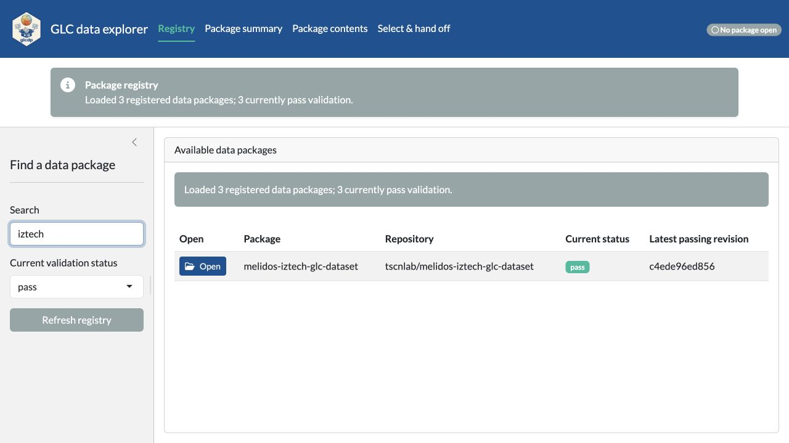
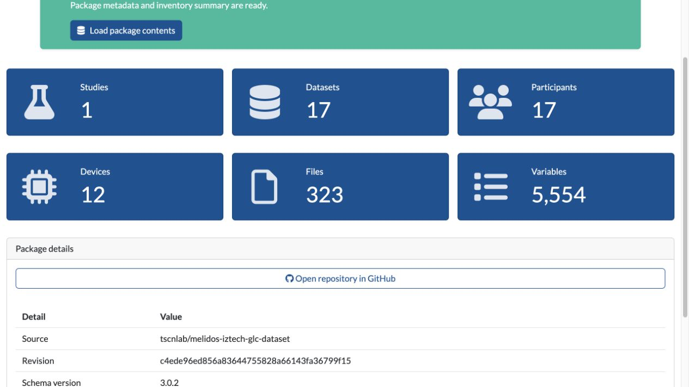
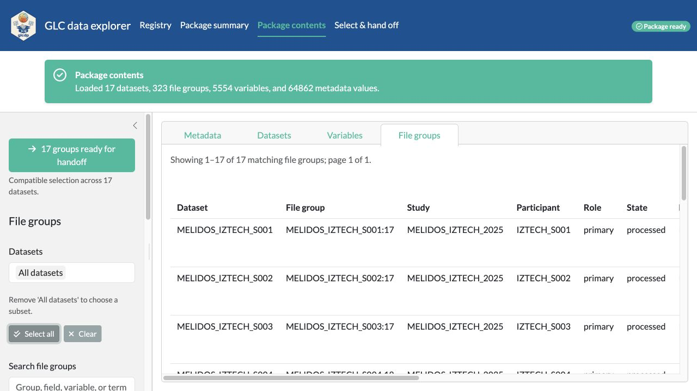
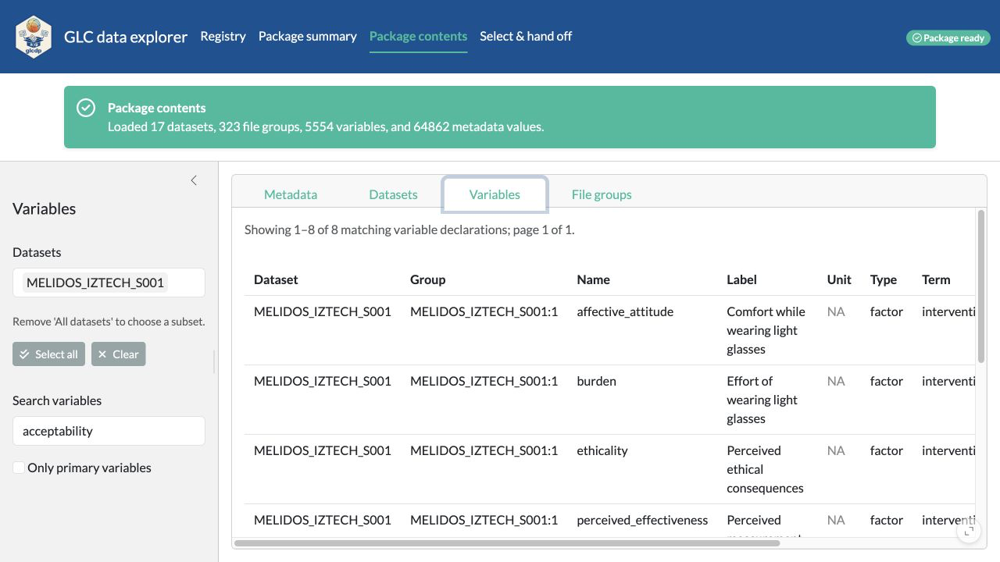
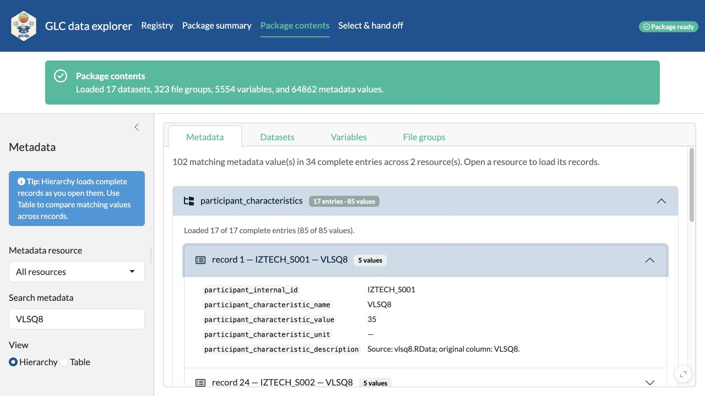
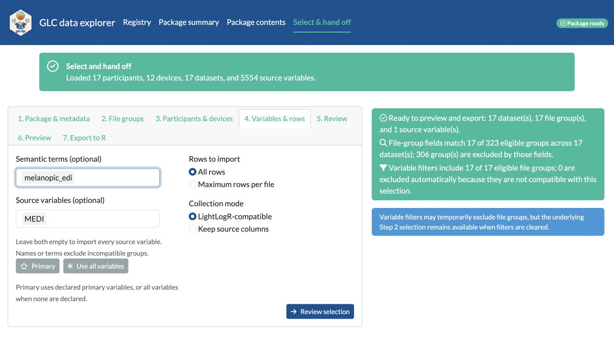
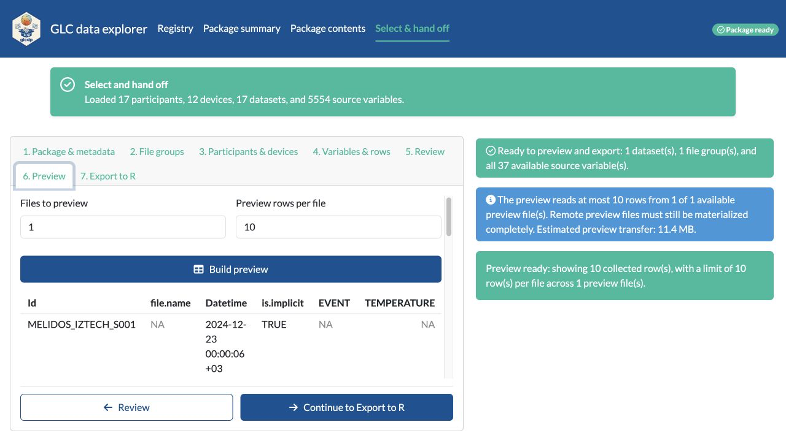
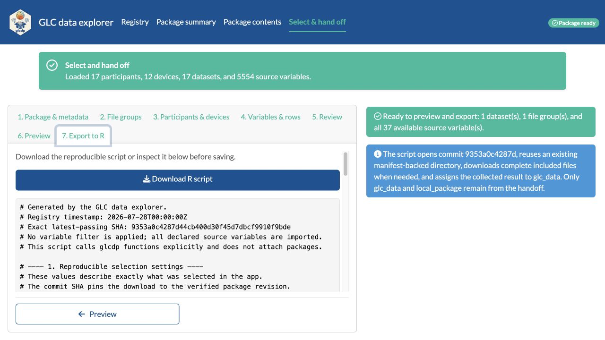
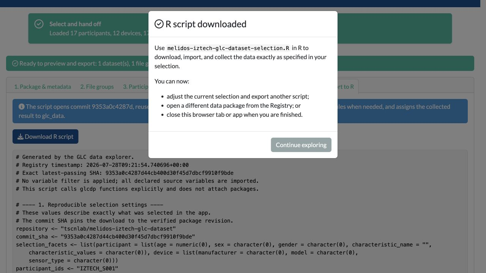

```{r setup, include = FALSE}
knitr::opts_chunk$set(
  collapse = TRUE,
  comment = "#>",
  fig.align = "center",
  out.width = "100%"
)
```

The GLC data explorer provides a guided path from a registered data package to
an annotated R handoff script. You can hand off the package and selected
metadata without importing measurement files, or build a reproducible data
selection without first learning every `glcdp` function.

This walkthrough uses the validated MELIDOS IZTECH package and its current
schema 3.0.2 declarations. It first explores all 17 participant datasets and
their repeated chest-sensor groups. The preview and export steps then narrow
to participant `IZTECH_S001`, dataset `MELIDOS_IZTECH_S001`, and file group
`MELIDOS_IZTECH_S001:17`.

Install the optional application dependencies once, then start the app:

```{r launch, eval = FALSE}
install.packages(c("shiny", "bslib"))
glcdp::glc_explore()
```

The app opens in a browser. It runs in the current R session, and package data
are not uploaded to another service.

## 1. Open the validated IZTECH revision

The **Registry** starts with packages whose current validation status is
`pass`. Search for `iztech` to isolate the MELIDOS IZTECH package. The status
message still reports the complete registry count, while the table shows the
matching repository, validation state, and abbreviated latest-passing SHA.

Only rows with a latest passing revision have an **Open** button. Opening the
IZTECH row uses its exact passing commit rather than a moving branch.

```{r registry-screen, echo = FALSE, fig.alt = "GLC data explorer Registry filtered to iztech, showing the passing MELIDOS IZTECH package and its latest validated revision"}

```

## 2. Understand the IZTECH package at a glance

After the package opens, the app moves directly to **Package summary**. The
validated revision contains 1 study, 17 datasets, 17 participants, 12 devices,
323 files, and 5,554 variable declarations. Each value box is a shortcut to
the corresponding inventory or metadata view.

Package details below the boxes pin the source repository, complete revision
SHA, schema version `3.0.2`, registry verification, modalities, and
`Europe/Istanbul` time zone.

```{r summary-screen, echo = FALSE, fig.alt = "MELIDOS IZTECH package summary with counts of 1 study, 17 datasets, 17 participants, 12 devices, 323 files, and 5,554 variables"}

```

The central success message also offers **Load package contents**, which starts
the larger inventory load while the summary remains visible. The same central
box confirms completion and offers **Open package contents**; a failed load can
be retried there. Opening the completed contents starts on **Metadata**, the
first Package contents view.

## 3. Inspect schema-defined variables

Use **Package contents** to examine four complementary views:

- **Metadata** provides both a hierarchical view and a comparison table.
- **Datasets** connects studies, participants, devices, modalities, file
  groups, files, variables, and time zones.
- **Variables** shows declared source columns, including names, types, units,
  semantic terms, and primary status.
- **File groups** shows which source files belong together.

The sidebar changes with the active view, has no redundant generic heading,
and shows only relevant filters.
For the many participant-specific file groups, filter by device, wearing
position and type, modality, role, state, contained variable, or semantic term.
Choices within a field use OR, while active fields combine with AND.
File-group and variable results are paged in groups of 100, so switching views
does not mount thousands of table rows in the browser. Search and field
selectors still cover the complete inventory.
Above the File groups filters, a compact handoff button summarizes the complete
filtered selection. When it is green, use **_n_ groups ready for handoff** to
transfer every currently matching group, not only the visible page, and
preselect the corresponding datasets and exact groups in the handoff workflow.
When it is orange, **Want to import these files? Filter them first** opens a
concise explanation of the incompatible fields and keeps the user in Package
contents to refine the filters.

The filtered state below confirms that all 17 IZTECH chest-sensor groups are
compatible for a direct handoff and offers the green transfer action above the
filters.

```{r file-groups-screen, echo = FALSE, fig.alt = "MELIDOS IZTECH Package contents file-group view filtered to chest position, showing 17 compatible groups across 17 datasets and the direct Select and hand off action"}

```

The **Variables** view is narrowed to `MELIDOS_IZTECH_S001` and the
acceptability declarations. Their schema-defined `factor` type is visible in
the inventory screenshot below. `glc_read()` also constructs factor levels in
schema-declared order; the code-based vignettes show those `factor_values` and
imported levels directly.

The Package contents step loads the metadata into the app once. The metadata
**Hierarchy** initially renders only resource summaries in the browser.
Opening a resource renders complete records in manageable batches; opening a
flat record shows its fields directly, and participant-characteristic labels
include both the participant and characteristic name. A schema-defined
singular flat child object, such as a variable's `dataset_file_variables_term`,
is shown inline with its parent; collections that can contain multiple records,
such as dataset variable terms, retain their record hierarchy even when the
current package happens to contain one. Use **Table** when you want configurable
paging across every matching leaf value. Within a record, fields that occur
more than once are folded by default and show their record count. Record nodes
use a general record icon that applies equally to people, files, terms, and
other schema objects. For example, the IZTECH study-group inclusion, exclusion,
and dataset lists can be expanded independently, while the single-valued name,
description, and size stay visible in a compact two-column layout. The label
column expands to the longest field name in its record and keeps code labels on
one line.

The thin activity pulse at the top of the page and local output spinners appear
when a tab or filter still needs reactive work. The central status box remains
the source of descriptive progress for the longer package-summary,
package-content, selection, and preview loads. Expanding a dense metadata
record also shows an indeterminate progress bar and record-specific loading
message in the exact place where its values will appear.

```{r contents-screen, echo = FALSE, fig.alt = "MELIDOS IZTECH variable inventory filtered to S001 acceptability variables, showing their declared factor type and semantic term"}

```

The focused metadata view below searches for `VLSQ8`. Opening the matching
participant-characteristics resource renders all 17 complete records, while
opening one record shows its five fields directly.

```{r metadata-screen, echo = FALSE, fig.alt = "MELIDOS IZTECH metadata hierarchy filtered to VLSQ8, with the participant-characteristics resource and the compact five-field record for participant S001 expanded"}

```

## 4. Choose a handoff and follow the guided steps

Open **Select & hand off**. A full-width wizard keeps all seven switchable
steps visible across the top. Each step uses a control column on the left and a
stable information column on the right, so status and validation messages no
longer move the wizard. On wide screens, compact controls in the left column
also share rows. The wizard fills the available window height, with its
controls scrolling inside a stable card and equal-width Back/Continue actions
anchored at the bottom. Long dataset and exact-file-group selections scroll
inside their controls rather than stretching the step. The first step pins the
opened repository and exact validated revision, then asks what the generated
script should load.

Choose **Package and metadata only** when measurements are not needed. Select
the metadata resources in **1. Package & metadata**; all core resources are
selected initially. **Review metadata export** goes directly to the generated
script. No dataset, file-group, variable, or participant choice is required,
and the data preview is intentionally skipped. The script opens the exact
revision, downloads only the selected metadata resources into a
manifest-backed directory, reopens the local package, and assigns the package
and named metadata list to `local_package` and `glc_metadata`. Temporary
handoff settings are removed after the script runs.

Choose **Import matching data** for measurement data, then work from top to
bottom:

1. In **2. File groups**, either use the groups transferred from
   Package contents or select datasets and apply device, wearing-position,
   modality, role, state, contained-variable, or semantic-term filters.
   **Exact file groups (advanced)** is available for a final manual subset.
2. In **3. Participants & devices**, optionally narrow people by age range,
   sex, gender, characteristic, or participant id, and devices by manufacturer,
   model, sensor type, or device id. Numeric characteristics use an inclusive
   range slider.
3. In **4. Variables & rows**, optionally search for semantic terms and
   source-variable names. **Primary** selects the variables declared primary
   by the schema and falls back to all variables when none are declared.
   **Use all variables** clears both variable controls.
4. Choose **All rows** or a **Maximum rows per file**, then choose
   LightLogR-compatible or source-column collection.
5. Use **5. Review**, **6. Preview**, and **7. Export to R** to inspect the
   selection, sample the data when applicable, and download the script. Review
   keeps both tables in the control column: **Selection summary** is expanded
   initially, while **Included file groups** stays collapsed until needed.
   Any visible wizard step can be revisited directly.

A transfer from Package contents switches to the data workflow, opens the
file-group step, and reports how many groups across how many datasets were
seeded. Leaving **Exact file groups (advanced)** empty includes every group
matching the field filters. Once an import semantic term or source name is
selected, the Explorer automatically retains one collectable subset and
separately reports how many groups were excluded by discovery fields and by
compatibility. This avoids presenting one error for every group that does not
contain the requested variable. The included-group table is paged at 100 rows
and long identifier lists in the summary are abbreviated, while the exported
script still retains the complete exact selection.

Selections made in **2. File groups** remain the user's baseline. Later
participant, device, variable, and row filters narrow the active result without
rewriting that baseline. If a later filter is cleared, the previously selected
datasets and exact file groups become active again instead of having to be
reselected.

The screenshot starts with all 17 datasets, filters the file groups to the
`chest` wearing position and groups containing `MEDI`, and requests source
variable `MEDI` with semantic term `melanopic_edi`. The field filters retain 17
of 323 groups and explain that 306 were excluded. The variable filters retain
all 17 compatible groups, so the selection stays ready instead of producing a
long incompatibility error.

```{r selection-screen, echo = FALSE, fig.alt = "Compatible MELIDOS IZTECH handoff for all 17 datasets, showing melanopic EDI and MEDI filters plus concise counts of 17 included and 306 structurally excluded file groups"}

```

## 5. Preview a small sample

For the smaller preview and export walkthrough, narrow the selection to
`MELIDOS_IZTECH_S001:17` and click **Use all variables**. The resulting summary
contains participant `IZTECH_S001`, device `IZTECH_AL02`, 1 dataset, 1 file
group, all 37 source variables, 1 file, and an estimated transfer of 11.4 MB.
The collection mode remains **LightLogR-compatible**.

Open **6. Preview** to inspect data before exporting. The default reads at most
10 rows from each of at most two files. **Files to preview** defaults to two
and is capped by the number available in the selection; this one-file example
therefore uses one. Enter another row limit, from 1 to 1000, or file limit when
a larger or smaller sample is more useful. Both preview settings are separate
from **Maximum rows per file**, which is part of the reproducible selection and
is passed to `glc_read()` by the exported script.

The preview limits rows parsed from each file, but a remote file must still be
transferred completely. The app therefore shows the estimated transfer for
the chosen preview files—11.4 MB in this example—before building the preview.
After **Build preview** completes, the collected table appears immediately
below that button in the control column. Only the result region scrolls; the
equal-width **Review** and **Continue to Export to R** buttons remain visible
at the bottom of the step.

The collected table demonstrates the 3.0 import path in the app: the package
dataset becomes `Id`, the declared timestamp becomes a timezone-aware
`Datetime`, schema booleans such as `is.implicit` are logical values, and
provenance fields remain visible. The first chest-sensor records are implicit
pre-recording timestamps, so their sensor measurements are correctly shown as
missing rather than being coerced to another value.

```{r preview-screen, echo = FALSE, fig.alt = "MELIDOS IZTECH preview step with separate file and row limits, the collected chest-sensor table directly below the full-width Build preview action, and fixed equal-width Review and Export navigation"}

```

## 6. Export the reproducible R workflow

Open **7. Export to R** and download the generated R script. The same script is
shown directly beneath the download button, while the **Preview** button stays
fixed at the bottom of the step. For a data handoff, the script shown for this
selection pins the full latest-passing SHA, participant, device, dataset, file
group, all source variables, maximum rows per file, and LightLogR-compatible
collection mode. Broad annotations explain each operation. The script:

1. records the registry timestamp, exact passing SHA, and selected ids;
2. reuses a matching local manifest-backed download or downloads the selected
   file;
3. opens that local package;
4. defines the requested `glc_read()` operation, including its row limit; and
5. collects the result into `glc_data` with the chosen column mode; and
6. removes temporary handoff settings, leaving only `local_package` and
   `glc_data` created by the script.

```{r export-screen, echo = FALSE, fig.alt = "Export step for the MELIDOS IZTECH chest-sensor selection, with the annotated R script directly below its download button, a fixed Preview button, and the exact passing revision described beside it"}

```

After the download completes, the app names
`melidos-iztech-glc-dataset-selection.R` and confirms that it can now be run in
R. Continue exploring to adjust the selection, return to the Registry for a
different package, or close the browser tab or app.

```{r complete-screen, echo = FALSE, fig.alt = "R script downloaded dialog naming the MELIDOS IZTECH selection script and offering to continue exploring"}

```

The downloaded script is the durable handoff: save it with the analysis so the
selected package commit and either its metadata resources or its measurement
files, variables, schema-driven import, and collection behavior remain
reviewable and repeatable.
